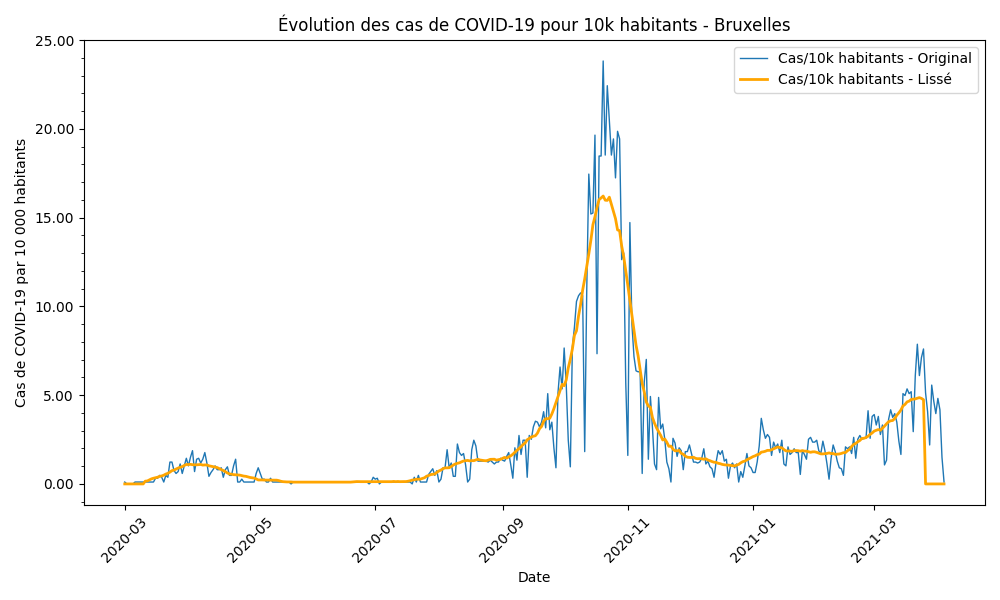
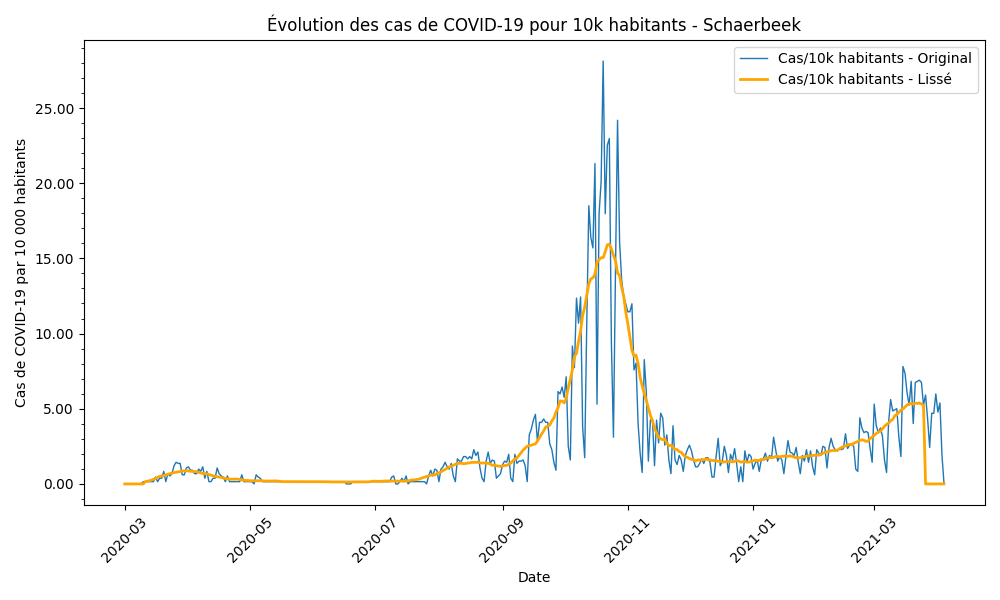
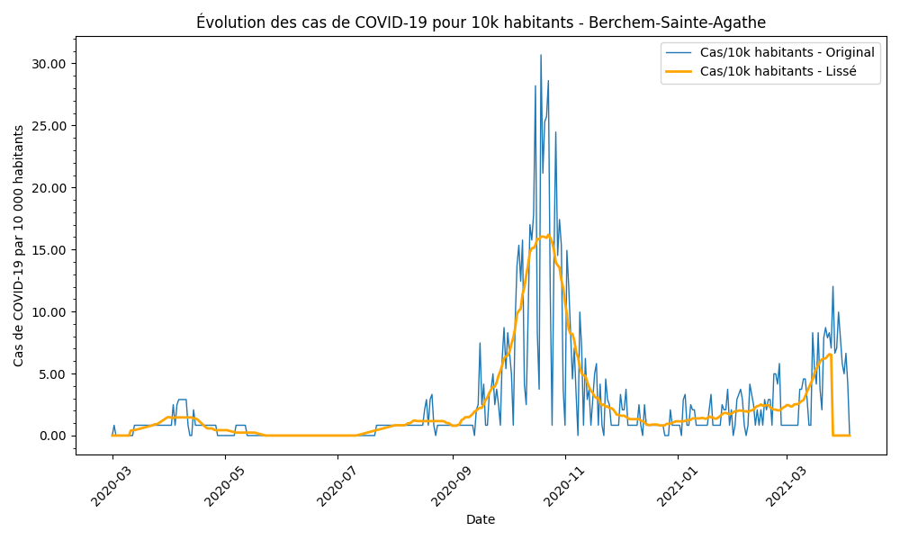
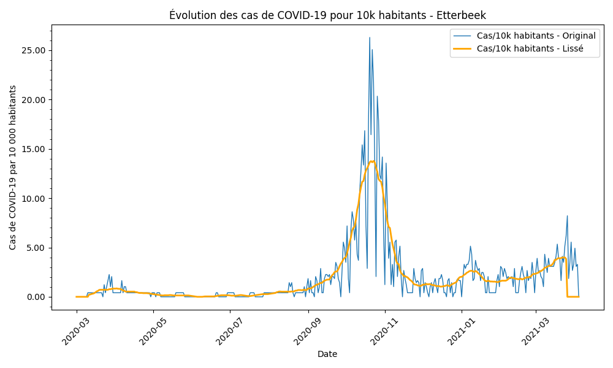
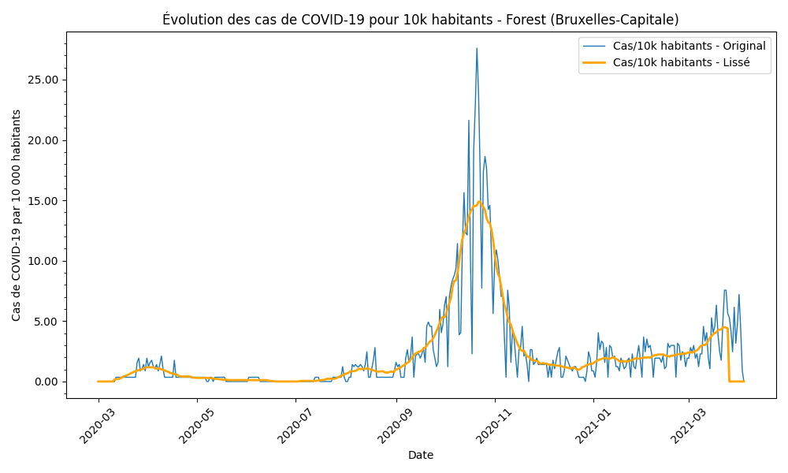
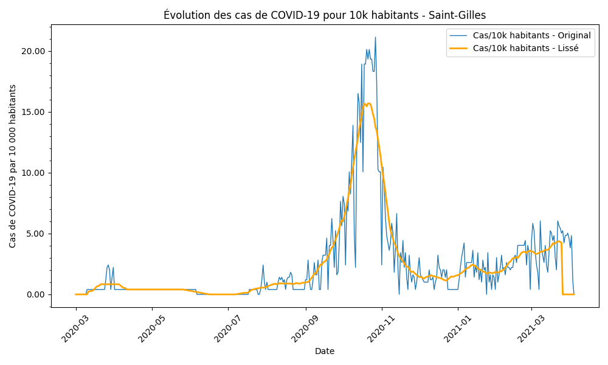
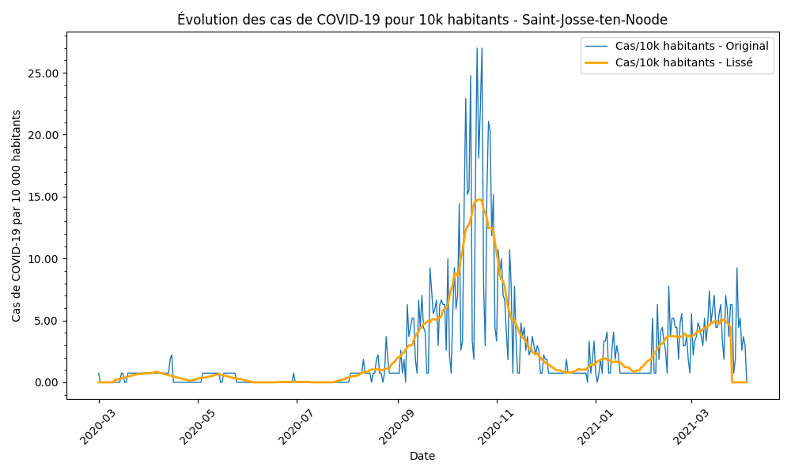
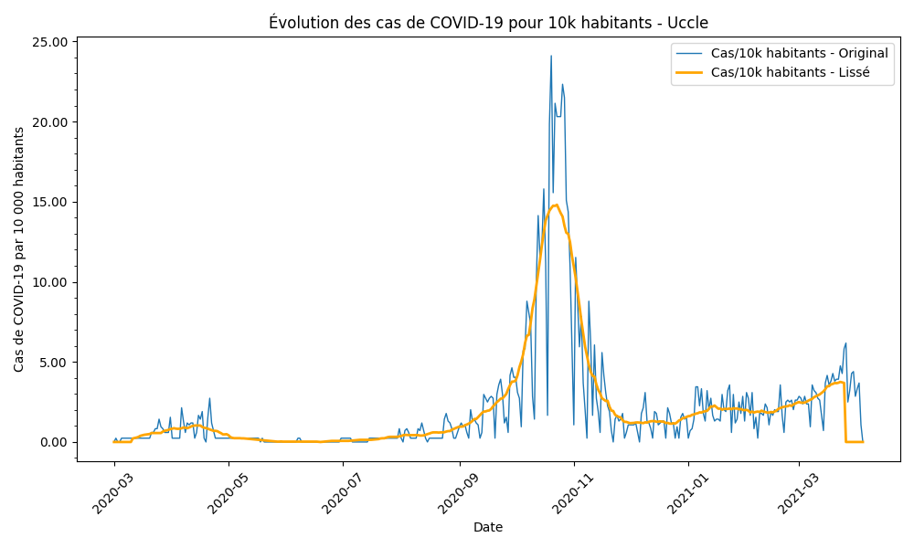
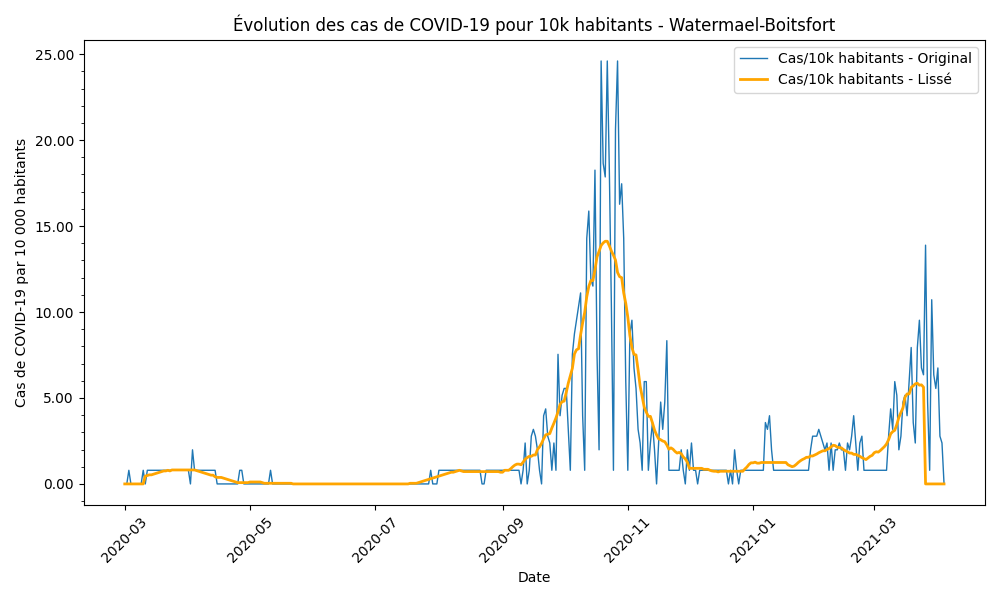
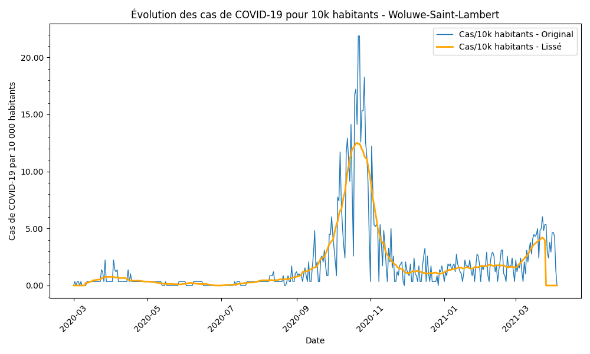

# MathCovidHMM
<h2>Projet de groupe dans le cadre du cours de mathématique appliqué à l'informatique.</h2>

<h3>
Nos consignes: 
<h4>sur base du modèle d'optimisation des chaines de markov à variables cachées,  
utilisez l'algorithme EM pour génerer des matrices de transition pour un graphe à 
19 sommets (communes de bxl),  en utilisant les données du fichier Json.
</h4>
</h3>

<h3>Qu'est ce que le hidden markov model ?</h3>
  
Un processus de Markov est un processus stochastique dans lequel la distribution de probabilité conditionnelle d'un état futur dépend uniquement de l'état actuel et, étant donné l'état actuel, il est conditionnellement indépendant du passé. Un modèle de Markov caché (HMM) est une extension dans laquelle la séquence d'états est latente et est révélée indirectement via un mécanisme probabiliste. En d'autres termes, un HMM est un processus stochastique doublement imbriqué avec une dynamique stochastique sous-jacente (par exemple, l'état de sévérité de la pandémie de COVID-19 dans une région géographique ou un état) qui, bien qu'inobservable (caché), peut être inféré par l'observation d'un autre ensemble de processus stochastiques liés (par exemple, les taux d'infection, les décès). Les HMM fournissent l'appareillage théorique nécessaire pour apprendre un modèle probabiliste à partir des données ; et en permettant à un HMM d'analyser les observations du COVID-19 dans une région, il est possible d'estimer quel état de sévérité caractérise actuellement celle-ci, et également de prédire l'évolution la plus probable de l'état de sévérité au fil du temps.

 

Nous avons commencé par un fichier excel relatant tous les cas d'infection en Belgique
sur une période du `01-03-2020` au `03-04-2021`.
Le fichier était pollué de données inutiles sachant que nous devions nous concentrer
sur les 19 communes de Bruxelles. 
Voici à quoi ressemblait le fichier excel initial: 
  

 

<h3>Etape 1: Traitement des données</h3>

Nous avons nettoyé les données pour n'avoir que ce dont
nous avions besoin.  
  

 
Puis nous avons remplacé tous les <5 par des 2. En dessous de 5
voulait dire un nombre de cas proche de 0 donc pour ne pas trop
off set les données, nous avons choisi en dessous de la médiane.
Et avons obtenu ceci:  
  

Ce dernier fichier excel a ensuite été transformé en fichier Json intitulé `Covid19CleanChanged3.json`.
Celui-ci n'était pas encore complet et utilisable.
Il nous manquait encore les données des jours où il y avait 0 cas
par commune. Celles-ci n'étant pas présentent, nous avons écrit un script
pour remplir les trous. A chaque jour où une commune n'apparaîssait pas, celle-ci se voyait
ajoutée au fichier Json et attribué un nombre de cas covid de 0.
 

Le script utilisé est le `updateJson.py`
Ceci nous donne notre `Updated_Covid19_Data.json`:

 

En nous basant sur plusieurs articles que nous avons lus, l'approche générale est de
standardiser les données. Nous avons donc multiplié le nombre de cas de chaque commune par 10 000
et divisé chacun de ces nombres par la population respective de celles-ci.
Voici les différentes populations:  
"Anderlecht": 121723

"Auderghem": 34543

"Berchem-Sainte-Agathe": 24113

"Bruxelles": 186784

"Etterbeek": 48672

"Evere": 42693

"Forest (Bruxelles-Capitale)": 56866

"Ganshoren": 25206

"Ixelles": 87517

"Jette": 52952

"Koekelberg": 22168

"Molenbeek-Saint-Jean": 97637

"Saint-Gilles": 49662

"Saint-Josse-ten-Noode": 27050

"Schaerbeek": 131892

"Uccle": 84188

"Watermael-Boitsfort": 25202

"Woluwe-Saint-Lambert": 58040

"Woluwe-Saint-Pierre": 42038

Ces chiffres ont été obtenues via : https://ibsa.brussels/chiffres/chiffres-cles-de-la-region

 

Grâce au script `standart.py`, nous obtenons donc un fichier Json presque utilisable intitulé:
`Standardized_Covid19_data10K.json`  
Nous avions aussi fait le test en prenant le nombre de cas par 100 000 mais nous obtenions des nombres 
de cas par jour trop farfelus.  
Nous obtenons donc des graphiques avec `GraphStandardised3.py` comme ceci :  

 

 

 

 

 

Une fois les données standardisée, nous devons encore les traiter un peu pour pouvoir les utiliser.
L'algorithme de Hampel, souvent utilisé dans le cadre du filtrage Hampel pour la suppression des valeurs aberrantes (ou "outliers"), est une technique robuste pour identifier et traiter les points anormaux dans des séries de données. Voici une explication simple et détaillée de cet algorithme :

### Fonctionnement de base
1. **Fenêtre glissante** : L'algorithme parcourt les données à l'aide d'une fenêtre glissante de taille configurable. Cela signifie qu'à chaque étape, il considère un sous-ensemble des données autour d'un point central. La taille de cette fenêtre détermine combien de points de données sont pris en compte à chaque étape.

2. **Calcul de la médiane et de l'écart-type robuste** : À l'intérieur de chaque fenêtre, l'algorithme calcule la médiane des données. La médiane est moins sensible aux valeurs extrêmes que la moyenne, ce qui la rend plus robuste. Ensuite, il calcule également une version robustifiée de l'écart-type, qui est une mesure de la dispersion des données autour de la médiane.

3. **Détection des outliers** : Pour chaque point de données dans la fenêtre, l'algorithme vérifie si ce point s'écarte de manière significative de la médiane par rapport à l'écart-type robustifié. Un point est généralement considéré comme aberrant si sa valeur dépasse la médiane de plus d'un certain multiple de l'écart-type robustifié (souvent autour de 2,5 à 3 fois).

4. **Remplacement des outliers** : Si un point est identifié comme un outlier, il est remplacé par la médiane de la fenêtre. Cette méthode de remplacement assure que les données restent lisses et moins affectées par des erreurs sporadiques ou des anomalies.

### Pourquoi utiliser le filtrage Hampel ?
- **Robustesse** : Le filtrage Hampel est particulièrement robuste contre les valeurs aberrantes car il n'utilise pas la moyenne, qui peut être fortement influencée par des valeurs extrêmes.
- **Adaptabilité** : La taille de la fenêtre et le multiple de l'écart-type peuvent être ajustés en fonction de la spécificité des données et du degré de sensibilité aux outliers souhaité.

### Applications typiques
- **Traitement de données temporelles** : Très utilisé pour lisser les séries temporelles où les valeurs aberrantes peuvent fausser les tendances et les analyses, comme les données de trafic, les relevés météorologiques, ou ici, les données liées au COVID-19.
- **Suppression du bruit dans les capteurs ou les mesures** : Idéal pour corriger les erreurs de mesure dans les données capturées par des capteurs.

En résumé, l'algorithme de Hampel est une méthode puissante et flexible pour nettoyer les ensembles de données, en assurant que les résultats des analyses soient fiables et non biaisés par des données anormales. Cela le rend extrêmement utile dans une multitude de contextes où la précision des données est cruciale.

Nous avons fait des tests en changeant de fenêtre, de 7 jours à 28   
Nous sommes partis sur une fenêtre pour Hampel de 7 jours
`hampel2.py` permet de comparer les différentes fenêtres, les graphiques sont disponibles ici:  
<a href="https://github.com/Veynah/MathCovidHMM/tree/main/Projet/CodeVERSION1/GraphHampel2TestWindowSigma3" target="_blank">Graphiques de comparaison de fenêtres</a>

 

### La prochaine étape ### 
est le lissage de la courbe. Pour adresser la présence de potentiels problèmes dans 
notre dataset, comme des données manquantes, des délais dans les rapports et dépistages ou des erreurs
d'encodage. Nous lissons les séquences avec un filtre de moyenne mobile (MA) à poids uniformes.  

### Qu'est-ce que la Moyenne Mobile (MA) ? ###
La moyenne mobile est une technique statistique utilisée pour analyser des séries de données en créant une série de moyennes de différents sous-ensembles du jeu de données original. C'est essentiellement une façon de lisser les données pour voir les tendances plus clairement, en réduisant l'impact du bruit ou des fluctuations à court terme.

### Pourquoi combiner MA avec Hampel ?
1. **Réduction du bruit** : La moyenne mobile lisse les séries de données en moyennisant les valeurs, ce qui aide à réduire le bruit et à clarifier les tendances sous-jacentes. Cependant, si des valeurs aberrantes extrêmes sont présentes, elles peuvent toujours influencer la moyenne, en particulier dans le cas de la SMA.

2. **Gestion des valeurs aberrantes** : L'algorithme de Hampel est très efficace pour identifier et remplacer les valeurs aberrantes qui pourraient fausser les résultats de la moyenne mobile. En utilisant Hampel avant d'appliquer la moyenne mobile, on peut s'assurer que les moyennes calculées sont basées sur des données plus fiables et représentatives.

3. **Amélioration de la précision des prévisions** : Dans les applications où les prévisions précises sont critiques, comme la finance ou la météorologie, l'ajout de l'étape de filtration Hampel avant le calcul des moyennes mobiles peut améliorer significativement la qualité des prédictions en éliminant les anomalies avant qu'elles n'affectent la moyenne.

 

## Hampel et MA ##

En utilisant `hampelMA.py` nous pouvons voir maintenant comment les données sont plus claires, lisses et utilisables maintenant. Notre choix de prendre une fênetre
de 21 jours vient d'un test précédent où nous avions utilisé une fenêtre de 7 jours et entrainé nos hmm dessus.
Nous pouvons comparer les résultats d'une fenêtre de 7 jours à ceux de 21 jours. Quelques exemples:  

<h4>7 jours  

 
<h4>21 jours</h4>

 

Voici tous les graphiques :

 

 

 

 

Il faut ensuite transformer ces données en quelque  chose d'utilisable. Grâce à `df_filtered.py` nous pouvons avoir un fichier csv avec des données sur
lesquelles nous pouvons entrainer nos hmm.

Donc avec une fenêtre coulissante de 7 pour Hampel et une moyenne mobile de 21 jours, nous pouvons obtenir de nouvelles données intitulées `CASES_PER_10K_MA`.
Nous avons fait en sorte de n'avoir que 2 chiffres après la virgule pour encore nous débarrasser du bruit et éviter les variations inutiles.

<h4>Fin des traitements de données.</h4> 
